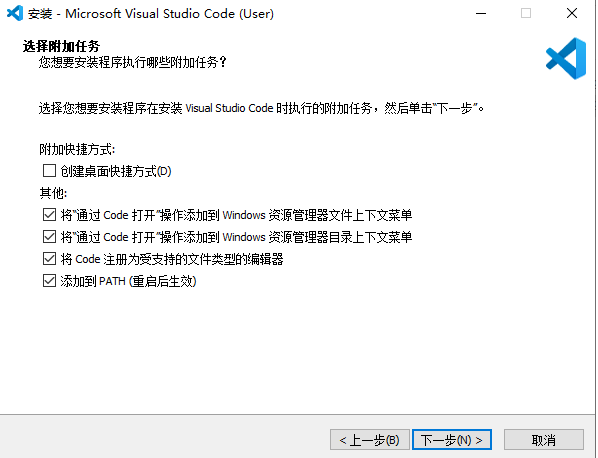
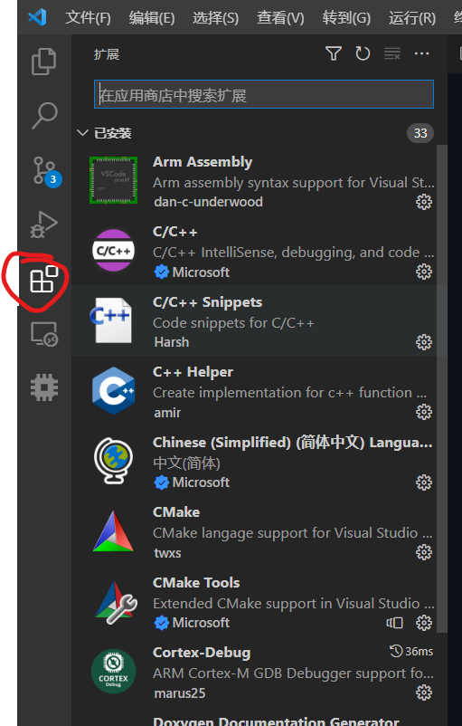
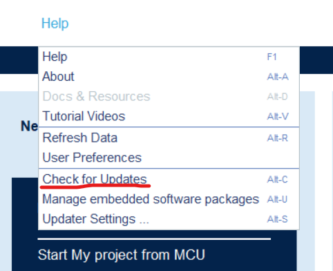

# 01-stm32基础，环境配置

## 课前：软件环境——从安装到卸载

**注意，所有软件的安装路径不能包含中文，且尽量不要包含空格和其他特殊符号**

### STM32CubeMX

[https://www.st.com/zh/development-tools/stm32cubemx.html](https://www.st.com/zh/development-tools/stm32cubemx.html)

获取软件按钮可能要加载一会才会出来

记得下载 windows 版本 `STM32CubeMX-Win`

填写信息这里，邮箱填能用的邮箱（一会儿下载链接直接发到邮箱里），姓名可以乱写


### gcc-arm-none-eabi

用于编译 arm 单片机的 gcc 编译器，版本要高于 8，否则 Cortex-Debug 不支持

可以使用群内安装包

> 注意，这个只能编译 arm 程序，不能编译电脑上运行的程序

**最后有一个界面问是否添加环境变量，要勾选上（如下选择）**


验证是否成功安装：
- 开始菜单搜索 cmd，打开命令提示符
- 输入 `arm-none-eabi-gcc -v`
- 回车
- 如果最后一行显示 `gcc version 10.3.1 20210824 (release) (GNU Arm Embedded Toolchain 10.3-2021.10)`就成功了

如果没成功，可以在群里问

### VS Code

#### 本体

[https://code.visualstudio.com/](https://code.visualstudio.com/)

安装时记得添加右键菜单（如下图，可以提高生活质量）



可以打开设置同步，多端同步，重装不愁

#### 扩展插件

安装方法：



- 必须安装的：
  - C/C++
  - Cortex-Debug
  - Embedded IDE
  
- 推荐安装的：
  - C++ Helper 自动头文件保护
  - Chinese
  - Markdown All in One
  - Markdown Preview Github Styling
  - Git History
  - CMake
  - CMake Tools
  - Doxygen Documentation Generator 写注释的插件

### git

建议先装 VS Code 再装 Git

安装参考 [https://blog.csdn.net/mukes/article/details/115693833](https://blog.csdn.net/mukes/article/details/115693833)

链接中需要注意的点：

- 2.2.3 可以勾选添加到 Windows Terminal （挺好用的一个命令行终端，可以从微软商店下载）
- 2.2.5 default editor 建议选 Visual Studio **Code（似乎只有安装 VS Code 之后才能选这个）**
- 其他的全默认就好

### Keil MDK

Keil 又叫 MDK，是付费软件

群里有安装包和破解器

安装破解参考 <https://blog.csdn.net/weixin_44500752/article/details/89248287>

安装后打开一个CubeMX生成的工程，让它下载组件包

如果下不动，参考 <https://blog.csdn.net/nicemz/article/details/101476631> 手动安装 STM32F1 和 STM32F4 的包


### JLink

> EIDE 会自动帮你下载安装，不需要手动安装

### 卸载

装上了还想卸载？

## 介绍 stm32、烧录器

### 硬件连接

电脑 <-> 调试器（下载器、烧录器）<-> MCU

### 编译步骤

1. 编译汇编各种 `.c` 文件和 `startup.s` 文件，生成许多 `.o` 二进制文件
2. 将许多 `.o` 文件根据 `.ld` 链接脚本链接成 `.elf` 或 `.axf` 可执行文件
- （可选）生成`.bin`文件（实际烧录进 flash 的数据）
- （可选）生成`.hex`文件（文本格式的程序数据）

注：
> `.ld` 里面记录了 arm 芯片中 flash 和内存的地址和大小等信息  
>`startup.s` 是启动文件，里面是汇编代码，完成 CPU 上电后相关的初始化，之后会调用main()函数  
> 一般 gcc 生成 `.elf` 文件，armcc 生成 `.axf` 文件  

### On-Chip Debugger(OCD)

在线调试器，负责电脑与调试器的通信

常用的 OCD 有：openocd, pyocd, STLink, JLink

其中 openocd 和 pyocd 支持很多调试器，STLink 和 JLink 只支持自家的调试器

### 烧录（下载）步骤

1. OCD 与调试器通信，发送可执行文件(一般`.axf`, `.elf`, `.bin`, `.hex`都行)
2. 调试器在接收的同时写入单片机 flash 中

### Debug

1. OCD 连接调试器
2. gdb 连接到 OCD
3. gdb 结合 .elf 和代码文件开始调试

## CubeMX 使用

### CubeMX 更新

建议都更新到最新版，之后会以最新版讲解

参考链接 [STM32CubeMx 软件版本的升级](https://blog.csdn.net/qq_17351161/article/details/89503826)

**记得下载好更新后要以管理员权限启动 CubeMX 安装更新**



新工程配置：

- RCC: HSE 选晶振 (Crystal Resonator)
- SYS-Debug: Serial Wire
- 时钟树
- 其他外设
- 生成：
  - MDK 或 CubeIDE (Generate Under Root)
  - Copy only the necessary...
  - Generate ... per peripheral

## MDK 使用

- 介绍界面
- 编译，下载，调试

## VS Code 配合 EIDE

### 界面、快捷键介绍

- 终端 Ctrl + `
- 命令面板 ctrl + shift + p
- 查找文件 ctrl + p
- 保存所有文件 Ctrl + K S

更多常用快捷键
  - Windows <https://code.visualstudio.com/shortcuts/keyboard-shortcuts-windows.pdf>
  - Linux <https://code.visualstudio.com/shortcuts/keyboard-shortcuts-linux.pdf>

### 设置

```json
"files.autoGuessEncoding": true,
"editor.mouseWheelZoom": true,
"security.workspace.trust.enabled": false,
"cortex-debug.showRTOS": true,
"EIDE.SourceTree.AutoSearchIncludePath": true,
"EIDE.ARM.Option.AxfToElf": true,
"explorer.copyRelativePathSeparator": "/",
```

> GDB 对 elf 文件支持较好

### EIDE
- 生成 Makefile 工程
- EIDE 空项目
- 添加普通文件夹
- 添加.s文件（重要！！！）
- 配置 GCC
- 预处理器定义

> 具体参考 [EIDE工作流.md](EIDE工作流.md)

## 一些有用的链接

[EIDE 官方文档](https://em-ide.com/zh-cn/docs/intro/)

[时钟树](https://zhuanlan.zhihu.com/p/339529771)

[STM32F40x 外设时钟树（其他型号也差不多)](https://blog.csdn.net/chenhuanqiangnihao/article/details/113331335)

[Git 教程](https://www.runoob.com/git/git-tutorial.html)

[bin、hex、elf、axf文件的区别](https://www.cnblogs.com/llxbl/p/10944160.html)
