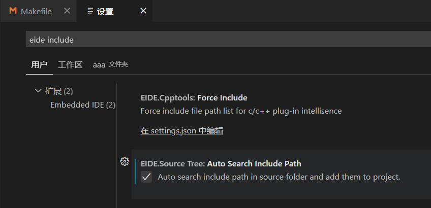

# EIDE 工作流

`CubeMX` - `VS Code` - `EIDE` 工作流

## 构建工程步骤

### CubeMX 生成 Makefile 工程

> Makefile 是一种 linux 下的工程管理方法（Windows 下也能用），但我们生成 Makefile 只是为了方便获取要编译的源文件列表、包含路径、预处理定义等信息，并没有真正使用 Makefile。（感兴趣的同学可以自己百度了解）

### 创建 EIDE 空项目

用 VS Code 打开刚才生成的工程目录

EIDE - 新建项目 - 空项目 - Cortex-M - 输入项目名称（需要和 CubeMX 生成的文件夹名称相同）

> 首次打开 EIDE 时会提示下载运行库之类的东西，点确定让它自己下载就好

弹出文件夹选择窗口，选择工程目录的上一级文件夹

出现如下警告时，点 yes，并在之后的弹窗中选择切换到工作区


之后在 VS Code 中的资源管理器应该可以看到这些文件（夹）


> （如果看不到 `Core`, `Drivers` 等文件夹，很可能是项目名称不一致或没有选择上一级文件夹，导致 EIDE 工程创建到了别的地方，建议 remake）

### 配置 EIDE 工程

打开 EIDE 插件栏（如下图）


#### 添加 .s 文件

> 之所以先添加 .s 文件，是为了防止遗忘

项目资源 - 右键 - 添加文件

这里选 asm 或 any


然后选择名称类似 `startup_stm32xxxxx.s` 的 `.s` 文件（不同芯片文件不同）

#### 添加 .c 文件夹

项目资源 - 右键 - 添加源文件夹，选择普通文件夹

添加 `Core`, `Drivers` 等所有包含 .c 文件的文件夹

#### 配置 GCC 

配置以下部分：

- CPU 类型：可以在 `CubeMX`、`百度` 或者生成的 `Makefile` 里查到
- 链接脚本路径：填写工程目录下 `STM32xxxx_FLASH.ld` 文件的相对路径（不同芯片文件不同）
- 对于有 FPU 的 CPU：
  - 在硬件浮点选项中选 `single` （对于 Cortex-M4）
  - 在构建器选项 - 全局选项 - 硬件浮点 ABI 选 hard（记得保存）

> 在 Makefile 里可以找到这些：

```makefile
# cpu
CPU = -mcpu=cortex-m4

# fpu
FPU = -mfpu=fpv4-sp-d16

# float-abi
FLOAT-ABI = -mfloat-abi=hard
```

#### 烧录器配置

根据自己使用的烧录器和芯片配置即可

#### 项目属性

##### 包含目录

如果设置中勾选了 `EIDE.Source Tree: Auto Search Include Path`（如下图），那么 EIDE 会自动搜索项目资源中添加的文件夹，这里就不用手动填入了



否则参考 Makefile 填入对应的文件夹

> Makefile 相关部分长这样，注意要去掉每行开头的 `-I` 和最后的 `\`
```
# C includes
C_INCLUDES =  \
-ICore/Inc \
-IDrivers/STM32F4xx_HAL_Driver/Inc \
-IDrivers/STM32F4xx_HAL_Driver/Inc/Legacy \
-IDrivers/CMSIS/Device/ST/STM32F4xx/Include \
-IDrivers/CMSIS/Include
```

##### 预处理器定义

Makefile 相关部分长这样：

>注意去掉 `-D` 和 `\`

```
# C defines
C_DEFS =  \
-DUSE_HAL_DRIVER \
-DSTM32F407xx
```

在预处理器定义栏点击 `+` 出现这个：


可以用 `;` 分隔每个定义，例如 `USE_HAL_DRIVER;STM32F407xx`（不同芯片不一样）

**至此，配置完成！`F7` 编译一下试试？**

## 一些技巧

### 一键编译烧录
在 EIDE 工程打开时，按 `ctrl`+`shift`+`p`，输入 `eide` 可以找到许多相关命令


可以给 eide: 构建、烧录分配快捷键，实现一键编译烧录（当然你每次在这里点也可以）
