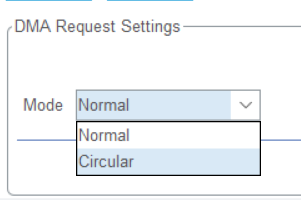

# 串口

## 硬件连接

一般异步模式的串口使用较多

异步模式需要连接 `TXD`, `RXD`, `GND`

> 其中，`TXD` 是发送引脚，`RXD` 是接收引脚。双方的 `TXD` 和 `RXD` 要反着接。  
> `GND` 是用来共地的，串口通信的双方必须共地，否则电平会有问题。

硬件连接和底层通信协议看这个：

 [STM32—串口通讯详解](https://blog.csdn.net/qq_43743762/article/details/97811470)

> 软件部分不要看这个，因为他用的不是 HAL 库，和我们平常用的不同。  
> 我们使用的是 TTL 电平标准（因为不需要太长的通信距离，而且不需要转换芯片，连接方便）  
> 链接中还有USB转串口原理图，设计电路板时可以参考。  

注意：因为单片机供电是 3.3v 所以单片机的引脚电平是 0~3.3v, 而不是链接中的 0~5v

## 软件部分

CubeMX 和 HAL库中串口相关函数的使用看这个链接：[stm32cubemx 串口（详细）](https://blog.csdn.net/qq_45699195/article/details/119912517)

> 不要看上面链接中的重定向printf部分，写得不好，看我写在下面的`重定向printf`  
> 使用我写的 uart_printf.c 不需要打开 Use MicroLIB

串口中断可以参考这篇：<https://blog.csdn.net/boomboomy/article/details/121170004>

串口DMA 配置可以参考 <https://blog.csdn.net/weixin_44584198/article/details/119351052>

串口DMA用起来和中断基本上一模一样，配置DMA后，你可以直接把以 `_IT` 结尾的函数改为以 `_DMA` 结尾。（下图的Circular 模式除外）

DMA是一种可以绕过CPU，直接读写内存和外设的模块。串口DMA模式和串口中断的区别是：DMA模式下串口要接收和发送的数据是由DMA在内存和外设之间传输的，不需要消耗CPU资源；而中断模式是由CPU传输的，需要消耗CPU资源。

### 重定向printf

将下面这个文件添加到工程中，修改其中的 `debug_huart` 为你使用的串口，然后就可以开心地使用 printf 了（记得 `#include <stdio.h>`）

[uart_printf.c](./uart_printf.c)

> 我写的 uart_printf.c 对 GCC，ARMCCv5 和 ARMCCv6 都做了适配，并且对于 ARMCC 编译器关闭了半主机模式（GCC 编译器默认不使用半主机模式）  
> 如果没有关闭半主机模式，那么重定向 printf() 后程序会在进入 main() 函数前卡死。  
> 解决方法通常有两种：使用 MicroLIB 或直接关闭半主机模式。  
> MicroLIB 是超级精简版的C语言库，删掉了半主机模式（所以实际上也是通过关闭半主机模式解决的），但也删掉了一些库函数，执行效率也比较低，所以不太推荐使用 MicroLIB

至于半主机模式是啥，感兴趣可以了解一下 <https://blog.csdn.net/weixin_40093087/article/details/77979108>

参考资料：
> [Disable semihosting with ARM Compiler 5/6](https://mklimenko.github.io/english/2018/11/02/disable-semihosting/)  
> [How do I use the printf function on STM32? (Answer by cp.engr)](https://electronics.stackexchange.com/a/279945)

## USB 转 TTL 模块在 windows 下有可能需要安装驱动

如果电脑无法识别你的 USB 转 TTL 模块，可以试试装驱动

驱动在战队网盘里有

位置：`\\pan.wtrobot.net\WTR\Softwares\Windows\Drivers\CH341SER.EXE`

或者百度 `CH341驱动` 

## 好用的串口软件：vofa

战队网盘里有安装包 

windows: `"\\pan.wtrobot.net\WTR\Softwares\Windows\vofa+_1.3.10_x64_installer.exe"`

ubuntu: `"\\pan.wtrobot.net\WTR\Softwares\Ubuntu\vofa+_1.3.10_amd64.deb"`

官网下载： <https://www.vofa.plus/>

软件官方文档： <https://www.vofa.plus/docs/learning>

## uart_printf.c 原理解释

### 重定向原理

C 语言有 3 个流：stdin（标准输入流），stdout（标准输出流），stderr（标准错误流）

> 感兴趣的可以查看：[详解C语言中的stdin，stdout，stderr](https://blog.csdn.net/Crazy_Tengt/article/details/72717144)

printf() 是 C 标准库的函数，最终会向 stdout 中写入字符串。

向 stdout 或 stderr 中写入数据，最终是调用 `文件写入函数` 实现的（C 语言将标准流虚拟成了文件）

对于 GCC，调用的 `文件写入函数` 是 `int _write(int fd, char *pBuffer, int size)`

对于 ARMCC，调用的 `文件写入函数` 是 `int fputc(int ch, FILE *stream)`

因此对于不同的编译器，我们只需要自己实现对应的文件写入函数，即可实现 printf() 重定向

> 同理，实现文件读取函数，可以实现 scanf() 的重定向，但单片机一般不咋用这个函数，所以 uart_printf.c 里没有相关实现

### 为什么 `_write()` 等函数不用声明，它们是怎么被调用的？

因为这些函数原本是系统内部函数，在C标准库中已经声明，并且由C标准库调用，所以我们不需要再次声明，直接编译就能用了（因此只有 .c 文件，没有 .h 文件）

以上是总原理，具体实现中的细节在 uart_printf.c 中有注释，感兴趣的可以研究一下