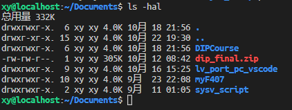

# ubuntu 基础知识

## 如何退出 vi 或 vim
vi 和 vim 是命令行下的文本编辑软件，初学者一定想知道不小心打开了这两个软件之后如何退出。

退出方法：
1. 先连续按几次 `Esc`
2. 然后输入`:q!`（是的，要输入冒号、q、感叹号）
3. 然后按回车

~~学会了如何退出就相当于学会了这两个软件~~

## 基础命令

```bash
ls      # 列出当前目录下的东西
ls -hal # l 表示竖着列出来；a 表示列出隐藏文件；h 会让文件大小看起来更直观（这3个字母顺序可以换）
ll      # ls -al 的简写
```
```bash
cd      # 切换目录
pwd     # 打印当前路径
```
```bash
code    # 打开 vscode
code 路径 # 用 vscode 打开文件（夹）
code . # 用 vscode 打开当前文件夹
```
```bash
nautilus            # 打开 Ubuntu 的文件管理器（nautilus是文件管理器的名字）
nautilus 文件夹路径 # 用 Ubuntu 的文件管理器打开文件夹
```

## apt 命令
### apt 和 apt-get
省流：这是两个不同的工具，建议用 apt

### apt update 和 apt upgrade
update 命令只会更新软件包列表，获得包的最新信息，并不会下载或者安装任何一个包。

apt upgrade 命令会按照软件包列表把这些包下载和升级到最新版本。

> 详细版：https://zhuanlan.zhihu.com/p/560735952

### 常用命令
```bash
apt # 显示帮助
sudo apt update # 更新软件包列表（只是更新列表，不会更新软件）
sudo apt upgrade # 更新软件包
sudo apt install 包名 # 在线安装一个包（如果已经安装，则更新这个包）
sudo apt install 路径 # 安装本地包(deb 文件)
sudo apt purge 包名 # 完全卸载一个包
apt list --installed # 列出已安装的包
```

## 文件、路径相关

Linux 中，以 `.` 开头的文件（夹）是隐藏文件（夹），如`.config`，需要在文件管理器中打开显示隐藏文件才能显示这些文件（夹）

Linux 使用一些特殊符号表示路径：

| 路径  | 说明                               |
| ----- | ---------------------------------- |
| /     | 根目录                             |
| ~     | 家目录（即 /home/用户名）          |
| .     | 当前目录                           |
| ..    | 上级目录                           |
| ../.. | 上级目录的上级目录（可以一直套娃） |

用户自己的文件建议放在家目录中，ubuntu 文件管理器中的`下载`、`文档`等文件夹都在家目录下。

在 ubuntu 中，使用正斜杠 `/` 表示下级目录，如 `~/Download`或`/home/用户名/Download`

> Windows 下斜杠使用比较混乱。Windows 系统本身使用反斜杠 `\`，但有些软件又使用正斜杠`/`或者双反斜杠`\\`  
> Linux 下统一使用`/`

## 权限相关
可以使用 `sudo chmod +x 路径` 赋予一个文件可执行权限  
可以使用 `sudo chmod -x 路径` 删除一个文件的可执行权限

可以使用 `ls -hal`或`ll`查看当前目录下所有的文件和文件夹以及它们的权限，如图



省流版：每一行的类似这样的一串字符表示权限`rwxrwxr-x`，带有 x 的表示有可执行权限（有可执行权限的文件也会用不同颜色标记）

详细版：从上面可以看到，每一行都有7列，分别是：
- 第一列共10位
  - 第1位表示文档类型：
    - d  目录文件
    - l  符号链接
    - s  套接字文件
    - b  块设备文件，二进制文件
    - c  字符设备文件
    - p  命名管道文件
  - 后9位表示权限：
    - 这9位要拆成三部分看：比如`rwxrwxr-x`要拆成`rwx rwx r-x`，这三部分从左到右分别代表所有者(owner)、群组(group)、其它组(others)的权限。
    - 每一部分中，`r`代表可读，`w`代表可写，`x`代表可执行
- 第二列表示链接数
- 第三列表示拥有者
- 第四列表示所属群组
- 第五列表示文档容量大小
- 第六列表示文档最后修改时间，注意不是文档的创建时间哦
- 第七列表示文档名称。以点(.)开头的是隐藏文档

chmod 和 ls 详细说明请看 <https://zhuanlan.zhihu.com/p/355450290>

## path 环境变量
概念：Linux 执行程序时，如果没有指定路径，则会从 path 环境变量中指定的目录顺次查找。（从前往后找）

（Windows 也有类似的机制）

如何修改：
1. 打开文件 ~/.bashrc
2. 在最后一行添上：
    ```
    export PATH=/new/path:$PATH
    ```

> 原理：  
> `$PATH` 表示 PATH 环境变量的内容  
> `:` 是 PATH 变量中，多个目录的分隔符  
> `/new/path:$PATH` 表示在 PATH 前面添加 /new/path:  
> `export PATH=/new/path:$PATH` 表示给 PATH 变量赋值为 /new/path:$PATH


生效方法：（有以下两种）
1. 关闭当前终端窗口，重新打开一个新终端窗口就能生效
2. 输入`source ~/.bashrc`命令，立即生效

查看当前的 PATH 变量：`echo $PATH`

## 程序相关
程序又叫做可执行文件

Windows 下的可执行文件有后缀名`.exe`，Linux 下没有

> Windows 在终端中运行可执行文件，可以省略后缀名  
> 比如 gcc 的文件名在 Windows 下是 `gcc.exe`，在终端中可以输入`gcc.exe -v` 或者 `gcc -v`  
> gcc 在 Linux 下文件名就叫 `gcc`，所以在终端中输入`gcc -v`  
> 注`-v`是查看版本的参数


Linux 在命令行中运行可执行文件，首先要求该文件有可执行权限（见[权限相关](#权限相关)）

有可执行权限后，运行这个文件有两种方法：
1.  在文件管理器里双击
2.  在终端中运行，如：
    ```bash
    openocd   # 在 path 中寻找一个叫 openocd 的程序并运行它
    ./openocd # 运行当前目录下的 openocd
    ~/Download/openocd # 运行 ~/Download/ 目录下的 openocd
    ```
