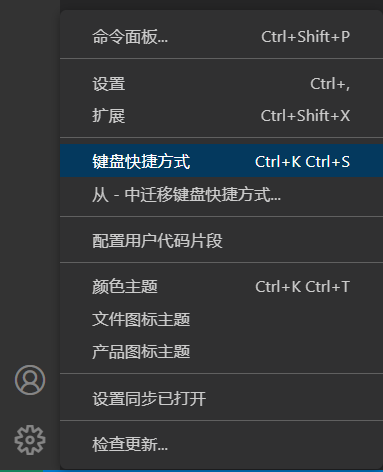
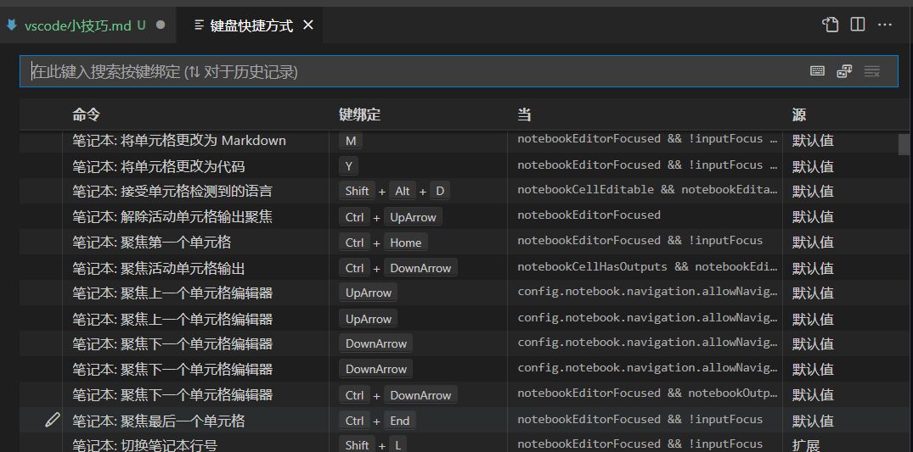
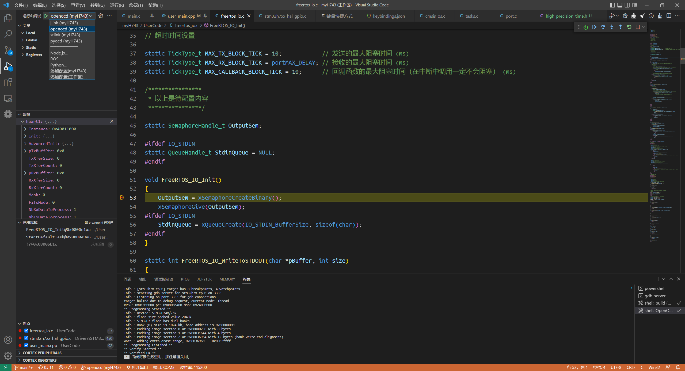

# vscode / eide 小技巧

## 目录结构

vscode 会在当前目录下创建 .vscode 文件夹，里面是这个目录相关的所有配置。  
这里面的配置只与当前目录有关。vscode 会优先使用这里的配置项，这里没有配置的部分使用全局配置。

.vscode 文件夹中可能有：

- settings.json ：一些设置项
- launch.json ：debug 相关的配置
- task.json ：任务相关的配置

如果打开的是 eide 工程，eide 会自动帮你配置这些文件

## 不要装太多插件
### 首先，卸载 makefile tools 这个插件
> bug 多，eide 工作流和 ros 都用不上，还会损坏工程（篡改CubeMX工程的.s文件）

有时候 vscode 右下角会有推荐插件，不要盲目点安装

有时候打开 vscode 右下角会有 cmake 插件问你要不要配置之类的，如果你不玩 cmake，就不要配置

## 用户代码片段

1. 齿轮->配置用户代码片段
2. 选择语言
3. 编写代码片段（注意每个代码片段之间要加 `,`）

可以帮你生成代码片段配置文件的网站 <https://snippet-generator.app/>

## 快捷键

快捷键可以极大地提高工作效率。建议为一些常用操作绑定快捷键。

另外，在 Windows 和 Linux 下有些默认快捷键不同。使用双系统的同学可能希望将它们改成相同的快捷键。

### 修改快捷键的方法

1. 点击齿轮->键盘快捷方式

    

2. 出来这个界面，可以在这里查看和修改各种键绑定

    

3. 如果想直接修改键绑定记录文件：点击右上角的  可以打开 `keybindings.json`

    修改这个文件和在 `2.` 中的图形界面修改是等效的（因为 `2.` 中的图形界面实际上也是对这个文件进行修改）

    没写在这个文件中的键绑定使用的是默认值。所以如果你把快捷键改出问题了，可以检查这个文件，把出问题的项删掉就能恢复默认。

    `keybindings.json` 文件解释：
    > 下面是一个例子。注意：每个键绑定之间要用 `,` 隔开，并且不能删掉最外面的中括号。
    ```json
    // 将键绑定放在此文件中以覆盖默认值auto[]
    [ // 中括号不能删
        {
            "key": "f8", // 快捷键
            "command": "eide.project.buildAndFlash", // 与该快捷键绑定的命令
            "when": "cl.eide.projectActived" // 该键绑定有效的条件。比如这里表示当 eide 的项目处于活动状态时，才能按 f8 运行编译烧录命令。（合理使用条件可以为同一个快捷键绑定不同命令）
        }, // 注意这里要有逗号
        {
            "key": "ctrl+i",
            "command": "-qmlFormatter.imports.organize", // 前面加上 - 表示删去这个键绑定
            "when": "editorTextFocus"
        }
    ] // 中括号不能删
    ```

### 建议修改的快捷键

- 一键编译并烧录

```json
{
    "key": "f8",
    "command": "eide.project.buildAndFlash",
    "when": "cl.eide.projectActived"
}
```

### 常用快捷键（默认值）

最常用的快捷键：

| 命令                        | 快捷键 (Windows)       | Linux(留空表示与Windows相同) |
| --------------------------- | ---------------------- | ---------------------------- |
| 终端                        | Ctrl + `               |                              |
| 命令面板                    | ctrl + shift + p 或 F1 |                              |
| 查找文件                    | ctrl + p               |                              |
| 保存所有文件                | Ctrl + K S             |                              |
| 切换头文件和源文件          | Alt + O                |                              |
| 缩进左移                    | Ctrl + [               |                              |
| 缩进右移                    | Ctrl + ]               |                              |
| 移动一行                    | Alt+ ↑ / ↓             |                              |
| 复制一行                    | Shift+Alt + ↓ / ↑      | 无                           |
| Start/Continue Debug        | F5                     |                              |
| Go to Definition            | F12                    |                              |
| Trigger suggestion          | Ctrl+Space, Ctrl+I     |                              |
| Format document             | Shift+Alt+F            | Ctrl+Shift+I                 |
| Format selection            | Ctrl+K Ctrl+F          |                              |
| Go back                     | Alt+ ←                 | Ctrl+Alt+-                   |
| Go forward                  | Alt+ →                 | Ctrl+Shift+-                 |
| Toggle block comment        | Shift+Alt+A            | Ctrl+Shift+A                 |
| Toggle line comment         | Ctrl+ /                |                              |
| Find                        | Ctrl+F                 |                              |
| Replace                     | Ctrl+H                 |                              |
| Go to beginning/end of line | Home / End             |                              |

> 使用双系统的小伙伴可以使用上一节的方法将 linux 和 Windows 的快捷键改成相同的

更多常用快捷键：
  - Windows <https://code.visualstudio.com/shortcuts/keyboard-shortcuts-windows.pdf>
  - Linux <https://code.visualstudio.com/shortcuts/keyboard-shortcuts-linux.pdf>

所有快捷键可以在左下角齿轮->键盘快捷方式中查看

## eide 的 烧录与调试

### 烧录

烧录时在烧录配置里选择对应的`在线调试软件`

Windows 系统下：
- STLink 选 STLink 或 Openocd
- JLink 选 JLink
- CMSIS-DAP（比如无线调试器） 选 Openocd

Linux 下:  
- 可以都选 Openocd

然后就能烧录了（记得先编译）

概念：
> **在线调试软件**就是是下拉菜单里的 STLink, JLink, OpenOCD, pyOCD，它们是软件  
> **硬件调试器**是那些长得像 U 盘的东西和黑色的 JLink 盒子等，它们是硬件，不要和软件搞混（虽然有些名字一样）  

软件层次：
> **在线调试软件**负责和硬件调试器的通信，可以用来烧录单片机和 debug。（可以理解为底层调试软件）  
> **arm-none-eabi-gdb** 是用来调试 c/c++ 程序的，它会和在线调试软件通信。（可以理解为上层调试软件）  
> **vscode** 又和 arm-none-eabi-gdb 通信，并把调试信息和操作以图形化界面显示出来。（可以理解为顶层调试软件）

常用在线调试软件说明：
> STLink 软件只能用于 STLink 硬件调试器  
> JLink 软件只能用于 JLink 硬件调试器  
> OpenOCD 软件理论上可以用于所有常见的硬件调试器（STLink, JLink, CMSIS-DAP等），但在 Windows 下因为驱动问题，不好用于 JLink  
> 还有一个 pyOCD，它也可以用于所有常见的硬件调试器，甚至在使用 rtos 时可以查看每个线程运行到哪里了，感兴趣的可以尝试。
### 调试

调试界面如图



注意左上角选对调试软件

调试软件的配置在工程目录的 .vscode/launch.json 中

在 eide 的烧录配置里选择并配置好`在线调试软件`，然后点击构建，eide 就会自动帮你配置好 launch.json

> 这里即使选择 STLink 实际上也是用 Openocd 调试的（可以从 launch.json 中发现）  
> 所以使用 STLink 也要安装 Openocd，并在烧录配置里选择 Openocd 然后构建一次，让 eide 自动帮你生成 Openocd 配置。

#### 调试技巧

- 使用 FreeRTOS 时，建议将断点打在线程中，这样才能进入线程调试。
- 因为单片机限制，断点数量不能太多（建议5个或以内），否则会报错。
- 左边的监视窗口可以输入变量和表达式，还可以查看数组，例子如下：
    ```
    huart1 // 查看变量、结构体
    &huart1 // 查看变量、结构体的地址
    *pointer // 查看指针所指向内存的值
    valueA - valueB // 计算表达式（valueA和valueB是程序中的变量）
    myArray // 查看 myArray 数组的值（根据代码中的定义自动判断长度）
    *myArray@20 // 查看 myArray 数组的值（给定大小为20）
    ```
- 调用堆栈可以看到当前的函数是从哪里调用的（卡在 HardFault_Handler 时这里非常有用）