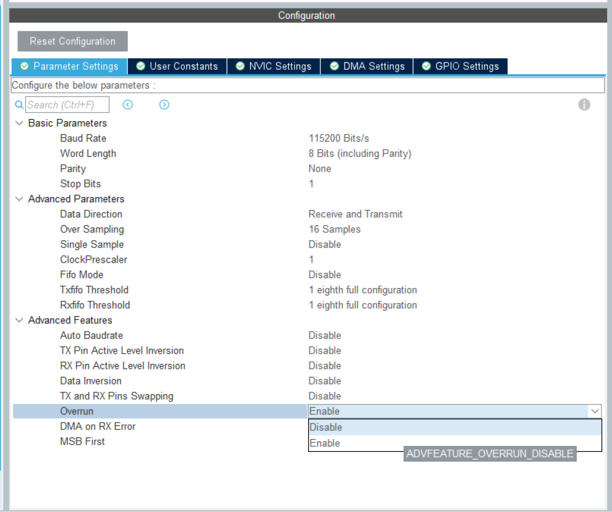

# 各种坑及问题
## HAL_Delay
`HAL_Delay(time)` 实际上延时 (time+1) ms. 

因此 `HAL_Delay(1)` 实际延时 2 ms, `HAL_Delay(0)` 实际延时 1 ms.

```c
__weak void HAL_Delay(uint32_t Delay)
{
  uint32_t tickstart = HAL_GetTick();
  uint32_t wait = Delay;

  /* Add a freq to guarantee minimum wait */
  if (wait < HAL_MAX_DELAY)
  {
    wait += (uint32_t)(uwTickFreq); // 这句导致延时多了 1 ms
  }

  while ((HAL_GetTick() - tickstart) < wait)
  {
  }
}
```

## 中断里错误地使用延时、阻塞式发送数据的函数

中断里的代码要求执行时间尽可能地短（几个微秒以内），所以不能在中断里使用延时函数。

而数据收发所需要的时间也比较长（比如 115200 波特率的串口，1 ms 只能发送 11.52 个 uint_8，发送一个 uint_8 需要 89 微秒），所以也不能在中断中阻塞式发送数据。（但可以使用 DMA 和 IT 结尾的函数，因为这些函数不会阻塞）

> 我们用的电机CAN收发函数、mavlink发送函数也都是阻塞式发送，不要在中断中使用它们。

为什么要求执行时间尽可能地短：  
1. 在中断中 CPU 在处理中断程序，不会执行线程（或main()）中的程序。中断时间太长会导致线程执行不及时。
2. 对于同一个中断源，如果中断程序的处理时间大于相邻两次中断到来的时间，就会出现丢中断的问题。
3. 可能使其他中断源的中断不能得到及时响应甚至丢失中断。

## 在 taskENTER_CRITICAL() 和 taskEXIT_CRITICAL() 之间错误地使用延时函数

taskENTER_CRITICAL() 和 taskEXIT_CRITICAL() 之间的代码要求执行时间尽可能地短，并且不允许调用延时函数。

## 串口中断接收不进中断，ErrorCode 8

### 原因：发生了串口溢出错误 (Overrun Error, ORE)。
串口收到数据后，会将这个数据存放在串口的一个寄存器中。如果开启了中断接收，那么此时就会产生一个接收完成的中断，通知 CPU 来读取这个寄存器里的数据。如果CPU读取不及时，在CPU读取之前串口又收到了数据，就会发生溢出错误。

发生串口溢出错误意味着 CPU 处理速度跟不上串口接收速度，出现了丢包。

### 解决方法一：解决CPU读取不及时的问题
CPU读取不及时通常是串口接收回调函数处理时间太长导致的，请检查中断里是否调用了延时或者阻塞式收发函数。

另外也要注意精简中断回调函数，比如中断里只进行数据的转移，把复杂的计算放在线程里。

### 解决方法二：关闭串口溢出错误机制

**这种方法没有从根本上解决问题，串口仍然会丢包。**

有些型号的单片机可以在 CubeMX 里关掉串口的 Overrun 检测机制，如图，设置成 Disable：

> 有些型号的单片机没有该选项，请参考方法一或三。



### 解决方法三：清除错误中断标志

**这种方法没有从根本上解决问题，串口仍然会丢包。**

发生溢出错误后，中断接收会被停止，并且在清除这个错误标志之前不能再次开启中断接收。

可以使用如下代码，在出现ORE时清除这个错误，再开启中断接收：  
```c
UART_HandleTypeDef *my_huart = &huart1;
// 检测是否有 HAL_UART_ERROR_ORE 错误
if (my_huart->ErrorCode & HAL_UART_ERROR_ORE) {
    __HAL_UART_CLEAR_OREFLAG(my_huart); // 清除 OREFLAG
}

// 开启中断接收
HAL_UART_Receive_IT(my_huart, pData, Size);
```

