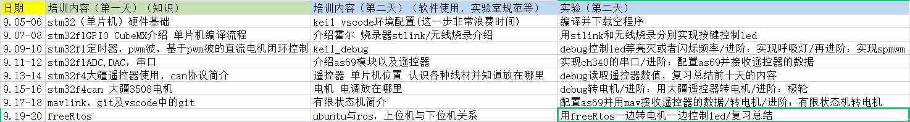

# WTR 电控组培训文档

Copyright (C) 2022 WTRobot HITsz. All rights reserved. 

## 课程
手机打开仓库网页后，点击 `View Code` 或者 `代码` 就能看到了

## 大概的培训内容和时间

## 相关链接

### WTR Library

[WTR Mavlink Library](https://github.com/MirTITH/WTR-Mavlink-Library)

[WTR IO_retarget Library](https://github.com/MirTITH/WTR-IO_retarget-Library) （重定向 printf 和 scanf）

[FreeRTOS NewLib 可重入内存管理](https://github.com/MirTITH/FreeRTOS_helpers)

### 本仓库

[GitHub仓库](https://github.com/MirTITH/WTR-EC-Training)

[gitee仓库](https://gitee.com/tithchan/wtr-ec-training)

## Tips

添加 GitHub 远程库为 origin，gitee 远程库为 gitee 后，可以运行 push.cmd 推送到两个仓库中