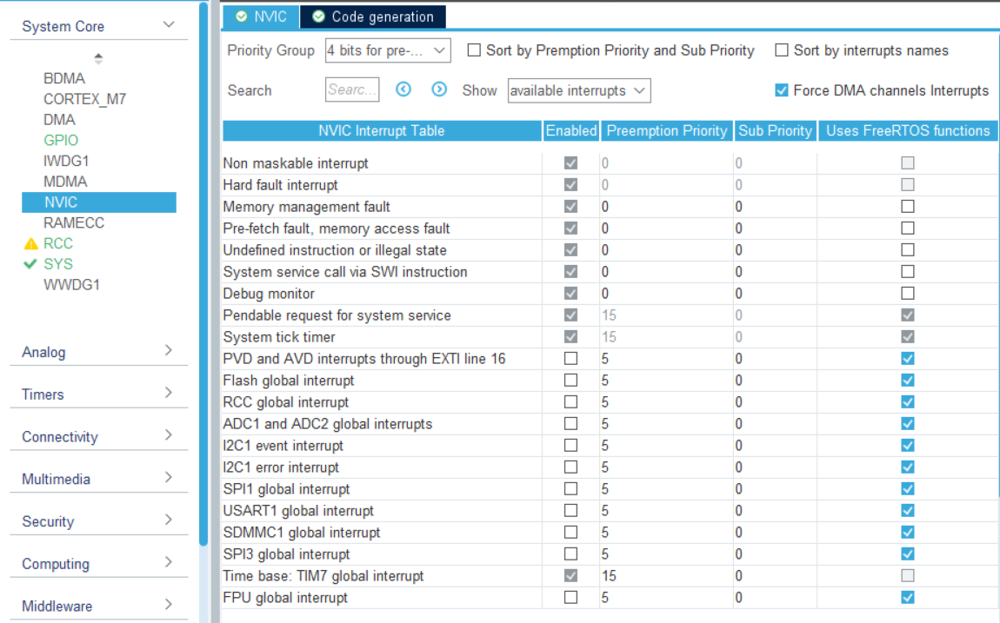
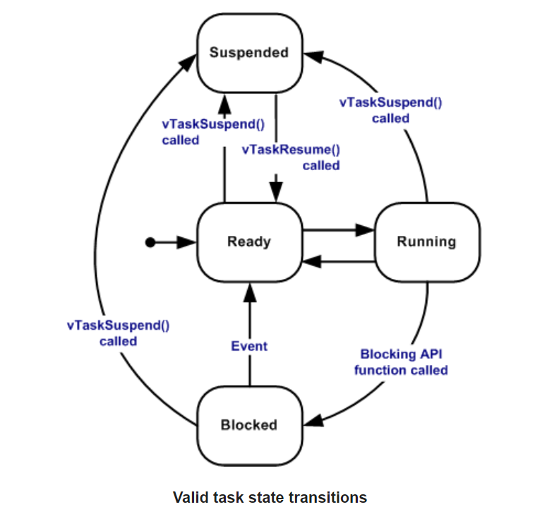

# 中断

## 什么是中断
CPU 有两个模式，线程模式和中断处理模式。

CPU 在每个指令周期会检测一下有没有中断标志。

> 什么是中断标志：  
> CPU 内部和一些外设都有中断标志位，这些标志位被设为特定值就表示有中断标志。  
> 比如串口外设收到数据后，这个外设的一个中断标志位就会被它自己设置为1。  
> 在CubeMX的中断向量表里可以看到有哪些中断。

通常情况下 CPU 处于线程模式。在线程模式里，CPU 执行普通线程（裸机只有 1 个线程（即main函数），使用 rtos 后就能创建多个线程）

如果检测到中断标志，CPU 就会进入中断模式，并处理相应的中断服务程序(Interrupt Service Routines, ISR)，其中包括各种中断回调函数。

> 关于检测到中断标志后 CPU 的行为，这里说的是一般情况，详细情况在下面讨论。

## 中断向量表

**在中断向量表里，数字越低，优先级越高**

## 中断优先级

### 抢占优先级和子优先级

stm32 的中断向量表里（如上图），Preemption Priority 是抢占优先级，Sub Priority 是子优先级（也叫响应优先级）。

**一般不使用子优先级，并且使用 FreeRTOS 时不能使用子优先级。**

## 什么是抢占

抢占抢的是 CPU 的执行权。通常情况下，CPU 处于线程模式，执行当前运行的线程（或裸机的 main 函数）。

如果此时 CPU 检测到有一个中断来临，CPU 就会暂停线程的执行，进入中断模式，处理相应的中断服务程序。

以上这个过程就好像是中断把线程的 CPU 执行权抢走了一样，所以取名叫抢占。

## 抢占的机制

在没有关闭中断的情况下：

1. 中断会抢占线程的 CPU 执行权

    `执行线程` --来了个中断--> `暂停线程，执行中断程序` --中断程序执行完了--> `继续执行线程`

2. 抢占优先级高的中断会抢占低的中断
   
    `执行线程` --来了个低抢占优先级中断--> `暂停线程，执行低抢占优先级中断程序` --来了个高抢占优先级中断--> `暂停低抢占优先级中断程序，执行高抢占优先级中断程序` -> 高抢占优先级中断程序执行完了 -> `继续执行低抢占优先级中断程序` --中断程序执行完了--> `继续执行线程`

3. 抢占优先级低的中断不会抢占高的中断（低的会等高的执行完毕再执行）

    `执行线程` --来了个高抢占优先级中断--> `暂停线程，执行高抢占优先级中断程序` --来了个低抢占优先级中断--> `先不管，仍然执行高抢占优先级中断程序` -> 高抢占优先级中断程序执行完了 -> `开始执行低抢占优先级中断程序` --中断程序执行完了--> `继续执行线程`

4. 同抢占优先级的中断不会互相抢占（后来的会等先来的执行完毕再执行）
   
    `执行线程` --来了一号中断--> `暂停线程，执行一号中断程序` --来了个同优先级的二号中断--> `先不管，仍然执行一号中断程序` -> 一号中断程序执行完了 -> `开始执行二号中断程序` --中断程序执行完了--> `继续执行线程`
5. 两个不同的中断同时到来时（多个同理）

    1. 先执行抢占优先级高的
    2. 如果抢占优先级相同，则执行子优先级高的
    3. 如果子优先级也相同，则按中断向量表的排序判断谁先执行

    > 同时到来指的是在一个 CPU 时钟周期内产生了两个中断标志

## 知乎大佬

关于中断，知乎上有一个很有意思的回答，建议看看：[中断同时发生时会发生什么？ - Makoto Ruu的回答 - 知乎](https://www.zhihu.com/question/27923521/answer/38714097)

# FreeRTOS

线程(thread)又叫任务(task)

## 线程状态
详细介绍：<https://www.freertos.org/RTOS-task-states.html>

省流版：  
线程状态图：

- Running：运行状态，线程正在执行（CPU同一时刻只能执行一个线程，所以只有一个线程处于运行状态）
- Ready：就绪状态，线程能够执行，但当前不在执行
  > 因为其他线程正在执行，而CPU同一时刻只能执行一个线程
- Blocked：阻塞状态
  > 在这个状态下，线程不会被执行
  > 比如调用vTaskDelay()后，线程会进入阻塞状态，直到延时时间结束  
  > 等待队列、信号量等也会使线程进入阻塞状态，直到超时时间结束
- Suspended：暂停状态
  > 和 Blocked 状态相似，线程不会被执行，但没有超时时间  
  > 只有使用 vTaskSuspend() 和 xTaskResume() 才能使一个线程进入和退出这个状态 

## 线程优先级

**再次强调：线程优先级都是在线程的范围内讨论的，因为线程一定比中断的优先级低，即中断一定会抢占线程的 CPU 执行权。**

> FreeRTOS 是这样定义优先级的：**数字越高，优先级越高**（和中断向量表里的相反）。因此为防止搞错，建议使用`osPriorityNormal`,`osPriorityBelowNormal`等指定线程优先级。

处于就绪状态和运行状态的所有线程：
  - 优先级高的线程会抢占优先级低的线程
  - 优先级相同的线程通过时间片轮询机制获得 CPU 执行权
    > 时间片轮询机制就是线程的执行权会周期性循环切换，切换的频率就是 CubeMX 里设置的 `TICK_RATE_HZ` （默认为 1000 Hz）

## 在中断中用 freeRTOS 相关的函数

只有在优先级低于 `LIBRARY_MAX_SYSCALL_INTERRUPT_PRIORITY` （默认为5）的中断中才能调用 FreeRTOS 的函数，并且只能调用以 `FromISR` 结尾的 FreeRTOS 函数

在 FreeRTOS 中调用 `taskENTER_CRITICAL()` 只会关闭优先级低于或等于 `LIBRARY_MAX_SYSCALL_INTERRUPT_PRIORITY` 的中断
